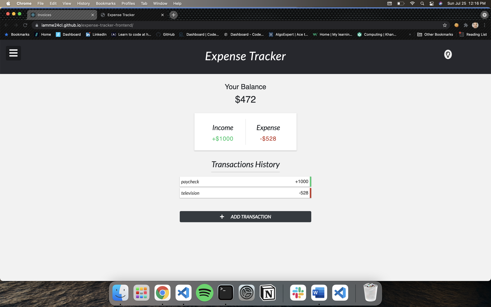
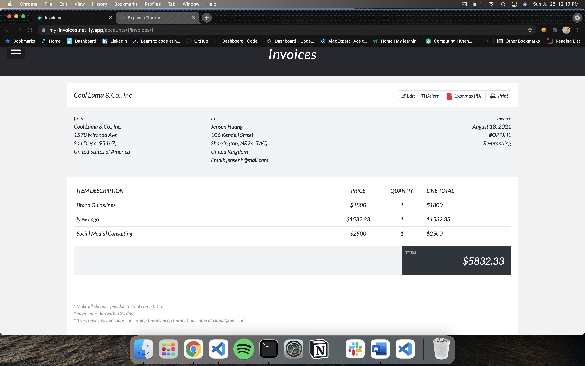
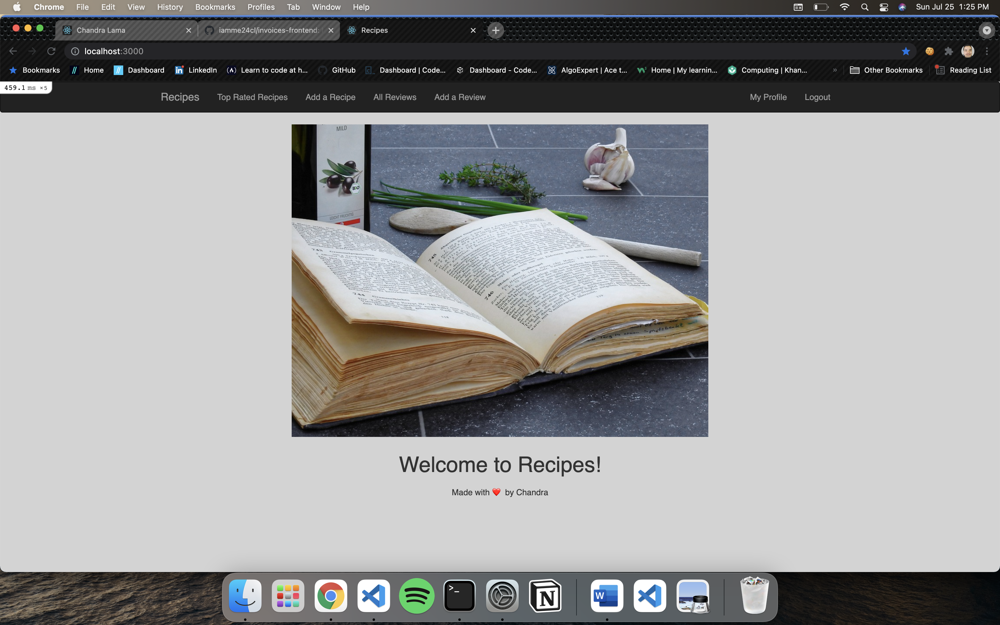

  
  

### 
I am Chandra 😀 🌙. I am a full-stack developer 🖥️ ⌨️
  
  

- 🏗️ I’m currently working on my  [Invoices](http://example/com) app and adding more features to it!  
  

- 📚 I’m currently learning Node.js and GraphQL    
  

- 😄 Fun facts: I love playing the guitar and tasting all the good wines I can find!   
  

   

## My Skill Set  
<table><tr><td valign="top" width="33%">

### Frontend  

  
  
  
  
  
  
  
  

</td><td valign="top" width="33%">

### Backend  

  
  
  
  
  
  
  
  
  
  
  
  

</td><td valign="top" width="33%">

### DevOps  

  
  
  
  

</td></tr></table>  

   

## A few things I built.  
  

### Expense Tracker  
  

  
  

This is an income and expense tracking application. Custom functionality and REST API is modeled with Active Record, Postgres, and Ruby on Rails. I developed a JavaScript front-end with object-oriented patterns to model the data fetched from the backend api, and implemented a responsive UI using CSS flex-box and Bootstrap.

  
   
 
## Invoices  
  

  
  

Single page application with React front end that creates and manages Invoices for an Account. I integrated Redux to maintain and update global state in store, made use of async actions and redux-thunk middleware to send data to and receive from a server, integrated React-Router and RESTful routing. Back End server built with Ruby on Rails and PostgresSQL

  
  
   

## Recipes  
  

  
  

Recipe manager app with user account functionality that lets you rate and review recipes and filter recipes. A user has many recipes and can create new recipe with ingredients or add an existing recipe, and manage his/her recipes list. API functionality built using Ruby on Rails, and the MVC pattern. Implemented RESTful URL patterns, and standard user authentication using Omniauth.

  
  
  

## MeroWineNotes  
  

  
  

Small Ruby application built on Sinatra framework. This is a wine journal app that lets you take notes on your favorite wines and save them to your account. You are also able to view other members wines and see what they are drinking and what they think about those wines. Account authentication is implemented using gem 'bcrypt' and active record has_secure_password on the User model.
  
  

      

## Connect with me  

  

  
  

   

## Github Stats  

  

   

  

   

  

 

----
