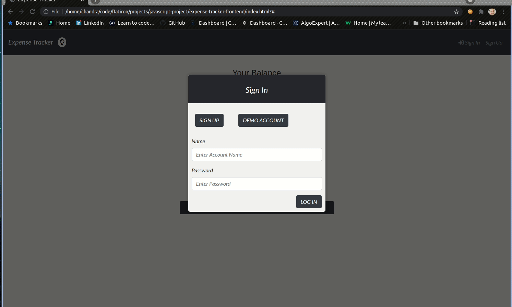

## 
HI! I am Chandra 🌙. I am a web developer ⌨️ 🖥️. 

Web Developer brought up on JavaScript and Ruby on Rails. Background in the food and wine Industry with strong interpersonal skills and rigorous positivity.

Excellent at analyzing and assessing customer needs and delivering products and services clients love. Passionate problem solver. A big believer of positive company culture, inclusive kindness, and innovative thinking.

I take great pleasure in learning new technologies, debugging errors, exploring new ideas & solutions, and sincerely dedicating myself to bringing the idea to life. 😀 
  

- 🏗️ I’m currently working on sharpening my system design & scalability knowledge 
  
  
- 📚 I'm currenlty practicing algorithms everyday and working on projects to hone my developer skills.

- 😄 Fun facts: I love playing the guitar, singing, and tasting all the good wines that I can find!   
  

   

## My Skill Set  
<table>
  <tr>
    <td valign="top" width="50%">
      
Frontend
  
      
  
          
          
          
          
          
          
          
      

    </td>
    <td valign="top" width="50%">
      
Backend
  
      
  
          
          
          
          
          
          
          
          
          
          
          
      

    </td>
  </tr></table>  

   

## Projects  
 

Invoices <a href="https://github.com/iamme24cl/invoices-frontend">Code</a> | <a href="https://my-invoices.netlify.app">Deployed Site</a>
  
   
    
  

    Full stack Invoice Managing application that lets you create your invoices and bill clients.
    Modeled API functionality following RESTful patterns and created a custom Api-key Class
    and controller module to handle authenticating users.
  
 

  

Expense Tracker <a href="https://github.com/iamme24cl/expense-tracker-frontend">Code</a> | <a href="https://iamme24cl.github.io/expense-tracker-frontend">Deployed Site</a>
  
   
    
  

    Full stack Expense tracking application with a Ruby on Rails backend. Developed a JavaScript 
    front-end and implemented a responsive UI.
  

  
  

Recipes <a href="https://github.com/iamme24cl/Recipes">Code</a> | <a href="https://my-recipes-2020.herokuapp.com/">Deployed Site</a>
  
    
    
  
Full stack Ruby on Rails application. This is a Recipe manager. Users are able to do all CRUD 
   functionalities. Users can also view and review other user’s recipes. Utilized the Omniauth library 
   to implement multi-provider authentication
  

  
  

MeroWineNotes <a href="https://github.com/iamme24cl/mero-winenotes">Code</a> 
   
    
    
  
Full stack Sinatra application that lets users manage their favorite wines and persist them to their
  account.

      

## Connect with me  

  

  
  

   

## Github Stats  

  

   

  

   

  

 

----
